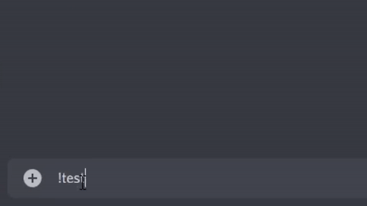

# V-Bucks Dealer V1.1.1, Developed By McZarya

# Change Log
Copy Cat Command
    Bug Fix: Fixed an issue with the bots status
#
Install Instructions

1: Open bot.js in your code editor and edit the client.login(The Bot Token) at the bottom of the page.

Once you have that done, save the file.

2: open your command prompt (cmd.exe) and type "npm install discord.js nodemon --save" without the qoutes 

3: Once it has finished installing all the dependencies, you can run start.bat.

I am not responsible for anything you do with this bot.
